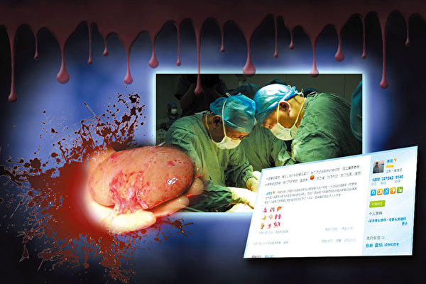

<h1>林輝：中共建政後至九十年代的活摘器官</h1>

【大紀元2017年06月16日訊】雖然在18世紀就有研究者在動物身上進行器官移植手術，但現代器官移植卻真正起源於前共產蘇聯。1936年，蘇聯醫生沃羅諾夫將一個屍體的腎臟移植到一位因汞中毒而腎衰竭、病入膏肓、無藥可救的年輕人體內，病人在48小時後死去。1954年，同卵雙生兄弟間的腎移植取得成功。自此，器官移植技術開始慢慢發展起來。

<h4>中共器官移植體制源自蘇聯</h4>

根據海外明慧網的一篇文章，中共建政初期，以共產蘇聯培養醫療衛生人才的方法為藍本，改造了中國傳統的醫學教育模式，建立起高等教育的制度與體制。此外，中國的器官移植體制繼承了蘇聯的體制，既沒有中國五千年傳統文化中天理對醫生醫德的要求，也沒有西方傳統醫學中希波克拉底誓詞道德倫理規範，從其開始就是不受任何道德倫理約束的畸形體系。

東方自古要求醫德，唐代名醫孫思邈在《大醫精誠》中提到，「先發大慈惻隱之心……如此可為蒼生大醫，反此則是含靈巨賊。」並講到，殺死一條生命以救活另條一生命，那麼，你和他的生命反而遠離生存而早死。明白此理者為「大哲」（大智慧）之人。

西醫中來自希波克拉底誓詞中的倫理觀要求避免一切墮落害人之敗行，因此，西方器官移植中對於捐贈器官者的同意書和判斷腦死亡標準看得非常之重，就是為了避免活摘器官和殺生害命。

在全世界，器官移植中，來自死人（腦死亡者）的器官都遠遠超過活體的器官數目。而唯獨在中國，器官大多來自活人，而不是來自死者，就是因為在中國沒有腦死亡的概念和法律，人呼吸心跳停止後才算死亡，這樣的器官往往已經失去了利用價值。而且，腦死亡的概念沒有被大多數中國人接受，沒有法律依據。超過90%的中國人沒有在遺囑中同意把自己的器官用於移植，也沒有和家人談論過這個話題。中國人由於傳統觀念，死後想落個全屍，也沒有捐贈器官的習慣。

在這樣的文化背景下，無疑，中共這樣的畸形器官移植體制為其草菅人命埋下了伏筆。

<h4>中共下發檔作為活摘器官依據</h4>

根據中共中央軍委在1962年的檔，省一級政府有權在所轄軍區的監管之下設立重刑犯罪分子的資源再回收機構，而且一直沿襲至今。根據該檔規定，死刑及罪大惡極的重刑犯罪份子可以根據「國家及社會主義發展需要」進行相應的「革命化處理」。

1984年10月9日，最高法院、最高檢察院、公安部、司法部、民政部、衛生聯合下發了《關於利用死刑罪犯屍體或屍體器官的暫行規定》，至今這一檔仍在執行。許多的地方公檢法部門對待該問題基本上要麼是直接移植然後火化，要麼擊傷進行形式死亡儀式後直接移植然後火化。

該文件規定：死刑罪犯執行後的屍體，在以下幾種情況下可以利用：一、無人收殮或家屬拒絕收殮的；二、死刑罪犯自願將屍體交醫療衛生單位利用的；三、經家屬同意的。該文還規定了嚴格保密及武裝警戒等事項：經執行的人民法院同意，可以允許衛生部門的手術車開到刑場摘取器官，但又不得有衛生部門標誌的車輛，不准穿白大衣。摘取手術未完成時，不得解除刑場警戒。

這一文件為死刑犯的器官買賣打開了大門。基本模式如下：1、在家屬不知道刑期的情況下，在火化後通知家屬領取骨灰。2、欺騙或逼迫家屬在同意捐獻器官證明上簽字。3、在未取得上述兩項要件或即使取得的情況下，為達到保密要求，也會採取以下的方法：手術車開到刑場，武裝警戒，秘密採摘器官，屍體裝入屍袋，運到殯儀館，推進火化爐，通知家屬領骨灰及交納子彈費、火化費等各種費用。

<h4>文革前後的器官移植罪惡</h4>

中共的器官移植業隨著其建政開始發展，移植醫生通過為中共高層保健服務而得到特權和利用軍隊系統和國家機器的機會，中共則利用這些醫生進行器官移植的培訓和推廣，形成共產黨體系內特有的器官移植系統。從1960年吳階平進行第一例腎移植開始，利用活體器官進行移植手術，滿足中共黨、政、軍界高級人員健康需要便成為慣例。

吳階平是泌尿外科醫生，文革期間，中共中央取消領導幹部配保健醫生的制度，成立了一個保健小組，吳階平任組長，全面負責中共領導人的健康。這樣的安排似乎也成為慣例。類似的有中共在2001年挑選肝移植專家黃潔夫作衛生部副部長，隨後，黃潔夫2005年7月升任中央保健局局長，成為負責中央保健委員會專家組、中央保健會診專家的總管，負責所有中共中央的領導人的醫療保健。

老年人的保健以心血管、慢性病為主，是內科醫生的專長，泌尿外科醫生和肝移植外科醫生成為中共高級領導的保健總管，本身就是違背醫療常識的。這背後的貓膩中共高層心知肚明。

關於文革前後器官移植的案例公開的很少見到，但還是有一些透露出來。如1977年10月，301醫院泌尿外科醫生李炎唐進行腎移植，活體取腎，取腎車由警車開道，一路開綠燈，通過通訊兵部隊架一條線，從取腎地點直接通到手術室，當腎取下可用時，立即通知手術，病人開始準備並開刀等待，兩不耽誤。再如1978年，江西小學教師鐘海源被活體取腎，移植給高幹子弟飛行員。

顯然，早在文革前後，利用軍隊系統搞器官移植，特別是使用活體器官來提高移植品質成為了中共器官移植的特色，而罔顧倫理正是中共器官移植的罪惡所在。

《九評共產黨》中曾寫道：「中共在文革的高潮階段，活取心肝已積累了相當經驗，加之吃過人肉的老遊擊隊員傳授，技術已臻於完善。譬如活人開膛，只須在軟肋下用刀拉一『人』字形口子，用腳往肚子上一踩，（如受害者是綁在樹上，則用膝蓋往肚子上一頂──）心與肚便豁然而出。為首者割心、肝、生殖器而去，餘下的任人分割。紅旗飄飄，口號聲聲，場面盛大而雄壯……」

此外，柬埔寨首都金邊罪惡館的展櫃前，陳列著S-21監獄，為了給柬共領導人進補，竟然由傳自中共援柬的「專家與技術人員」特製的鑽腦機，取人腦來製造補品。這種醫療術是否有效？無從查考。但已發現的幾千枚鑽孔人頭骨卻銘刻下一段柬共統治時期的真實歷史。

<h4>80年代至90年代的器官移植罪惡</h4>

曾在大陸被關押的民主人士魏京生在海外披露過這樣一件事：他在監獄時，遇到一個年輕的死刑犯。當時他早就聽說，在監獄裡頭是要把犯人的內臟割去做實驗或是器官移植試驗等等，但他將信將疑。在和這名死刑犯聊天中，魏京生請他幫自己證實一件事，那就是是不是有器官被割掉這個事。

魏京生告訴死刑犯，「一般人到那個情況都會大喊大叫，如果你看到有把你拉到中間那個大廳，就是死牢那個大廳，如果看到有穿白大褂、拿手術盒子的這個人，你就喊一句話，反正就是那種情況下你不能喊的一句話，很奇怪的一句話。如果你看到有這個就喊那個，沒看到你喊別的。你要被殺的時候你肯定會喊的，你能不能做？」死刑犯答應了。

果不其然，死刑犯被拉出去到那個大廳的時候，他就喊了約定的信號，這樣魏京生證實了中共活摘人體器官的存在。

還有一次監獄放風時，魏京生跟一個比較年輕的警察聊天，他突然說道：「你們把死刑犯的內臟割了以後去給中央首長移植是不是太慘忍了點？」 那個警察沒防備脫口而出，：「那個死的都是壞人，把他們的內臟拿去給中央首長，如果能救活中央首長不是還有價值嗎?」我說：「但是你們沒經過人家的同意啊？沒經過人家的允許啊?」他說：「反正是壞人，死人，幹嘛要經過他允許？允許也是一個死人，不允許也是一個死人！」我說：「那你在大廳裡就給人割了，人血糊拉查的，你還拉不拉去刑場給斃了？」「要，要斃呀，要過一道手續啊，不然檢察院不答應啊。」我說：「那你怎麼弄去啊？」他說：「那簡單！拿塑膠布裹起來呀。你沒注意嗎？中國槍斃的死刑犯都是兩個人架著過去的，那個人其實已經死了，架著那補一槍裝個樣子而已！」我：「你怎麼知道？」他說：「我參加過啊！我去參加過執行啊。」

除了魏京生說的這個案例，去年昭雪的聶樹斌案也涉及這一罪惡。1995年河北聶樹斌蒙冤被殺，據說當時很多辦案人員認為事實並不清楚，但據說為了給中央某個高官進行腎移植，聶樹斌被從重從快處決了。

而監獄中類似這樣被活摘器官的死刑犯不在少數。2006年，中共衛生部部長公開承認了中共使用死刑犯器官的罪惡。

<h4>結語</h4>

由於中共死刑犯的數量、身體狀況有限，中共摘取活體器官的數量有限。公開資料顯示，從1980到2000年年底，報告累計的腎移植數量總共為34,832例，這個數字在2000年後飆升。然而，儘管數量有限，但中共使用死刑犯器官的罪惡卻是不爭的事實，而這一點中共官方已經公開承認了，這樣的罪惡顯然非人類所能做出。

責任編輯：高義
